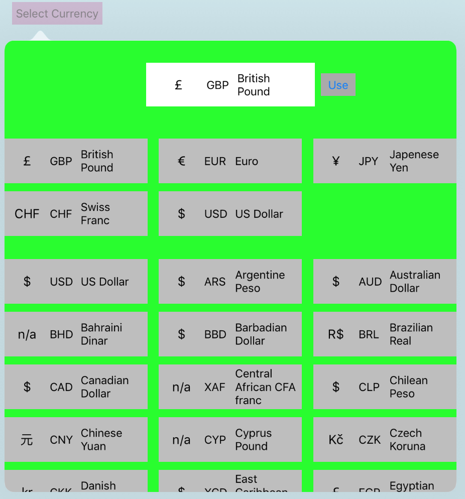

# BLAMCurrencyPicker

[](https://travis-ci.org/Peter Todd/BLAMCurrencyPicker)
[](http://cocoapods.org/pods/BLAMCurrencyPicker)
[](http://cocoapods.org/pods/BLAMCurrencyPicker)
[](http://cocoapods.org/pods/BLAMCurrencyPicker)

## Currency Picker for iOS apps
Presents a selection of all the ISO currencies in the world and returns the currency ISO code and unicode hex.  For example, for US Dollars returns "USD" and "\u{24}".


## Requirements
Swift 3 and iOS9.3+
## Installation
Included example app demonstrates how to implement the Currency Picker.
BLAMCurrencyPicker is available through [CocoaPods](http://cocoapods.org). To install
it, simply add the following line to your Podfile:

```ruby
pod "BLAMCurrencyPicker"
```

## Author

Peter Todd, peter@petertodd.com

## License

BLAMCurrencyPicker is available under the MIT license. See the LICENSE file for more info.
